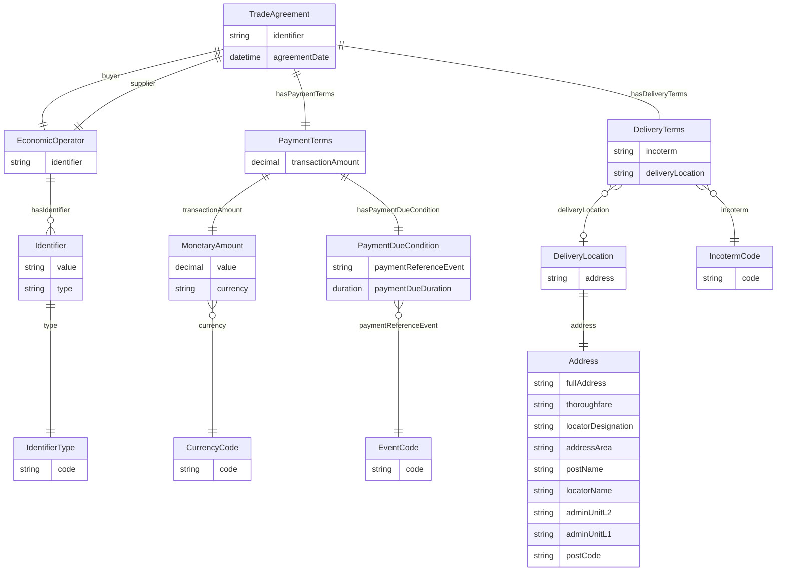

# Application Profile

## Innholdsfortegnelse
- [Application Profile](#application-profile)
  - [Namespaces](#namespaces)
  - [Conceptual Model (Tabular ER view)](#conceptual-model-tabular-er-view)
  - [Class TradeAgreement](#class-tradeagreement)
  - [Class EconomicOperator](#class-economicoperator)
  - [Class Identifier](#class-identifier)
  - [Class IdentifierType](#class-identifiertype)
  - [Class PaymentTerms](#class-paymentterms)
  - [Class MonetaryAmount](#class-monetaryamount)
  - [Class PaymentDueCondition](#class-paymentduecondition)
  - [Class DeliveryTerms](#class-deliveryterms)
  - [Class DeliveryLocation](#class-deliverylocation)
  - [Class Address](#class-address)
  - [Class CurrencyCode](#class-currencycode)
  - [Class IncotermCode](#class-incotermcode)
  - [Class EventCode](#class-eventcode)
  - [Controlled vocabularies](#controlled-vocabularies)

---

## Namespaces

| Prefix | Namespace |
|-------|----------|
| ebwv  | https://w3id.org/ebwv# |
| xsd   | http://www.w3.org/2001/XMLSchema# |
| skos  | http://www.w3.org/2004/02/skos/core# |

---

## Conceptual Model (Tabular ER view)

---

## Class TradeAgreement
URI: ebwv:TradeAgreement  
Requirement Level: Mandatory

| Property | URI | Range | Mult. | Req. | Description | Note | Usage note |
|---------|-----|-------|-------|------|-------------|------|-----------|
| identifier | ebwv:identifier | xsd:string | 0..1 | Optional | Identifier of the agreement | | External identifier if available |
| agreementDate | ebwv:agreementDate | xsd:dateTime | 1 | Mandatory | Date agreement becomes effective | | Legally binding date |
| buyer | ebwv:buyer | ebwv:EconomicOperator | 1 | Mandatory | Buyer party | | |
| supplier | ebwv:supplier | ebwv:EconomicOperator | 1 | Mandatory | Supplier party | | |
| hasPaymentTerms | ebwv:hasPaymentTerms | ebwv:PaymentTerms | 1 | Mandatory | Payment terms | | Exactly one per agreement |
| hasDeliveryTerms | ebwv:hasDeliveryTerms | ebwv:DeliveryTerms | 1 | Mandatory | Delivery terms | | Exactly one per agreement |

---

## Class EconomicOperator
URI: ebwv:EconomicOperator  
Requirement Level: Mandatory

| Property | URI | Range | Mult. | Req. | Description | Note | Usage note |
|---------|-----|-------|-------|------|-------------|------|-----------|
| identifier | ebwv:identifier | ebwv:Identifier | 1 | Mandatory | Identifier of the economic operator | | At least one identifier MUST be provided |

---

## Class Identifier
URI: ebwv:Identifier  
Requirement Level: Mandatory

| Property | URI | Range | Mult. | Req. | Description | Note | Usage note |
|---------|-----|-------|-------|------|-------------|------|-----------|
| value | ebwv:value | xsd:string | 1 | Mandatory | Identifier value | | |
| type | ebwv:type | ebwv:IdentifierType | 1..* | Mandatory | Identifier type | Value MUST be selected from a controlled vocabulary | See IdentifierType |

---

## Class IdentifierType
URI: ebwv:IdentifierType  
Requirement Level: Mandatory

| Property | URI | Range | Mult. | Req. | Description | Note | Usage note |
|---------|-----|-------|-------|------|-------------|------|-----------|
| code | skos:prefLabel | xsd:string | 1 | Mandatory | Identifier type label | Identifier Type Code List | Application-specific scheme list |

---

## Class PaymentTerms
URI: ebwv:PaymentTerms  
Requirement Level: Mandatory

| Property | URI | Range | Mult. | Req. | Description | Note | Usage note |
|---------|-----|-------|-------|------|-------------|------|-----------|
| transactionAmount | ebwv:transactionAmount | ebwv:MonetaryAmount | 1 | Mandatory | Amount to be paid | | |
| hasPaymentDueCondition | ebwv:hasPaymentDueCondition | ebwv:PaymentDueCondition | 1 | Mandatory | When payment is due | | |

---

## Class MonetaryAmount
URI: ebwv:MonetaryAmount  
Requirement Level: Mandatory

| Property | URI | Range | Mult. | Req. | Description | Note | Usage note |
|---------|-----|-------|-------|------|-------------|------|-----------|
| value | ebwv:value | xsd:decimal | 0..1 | Optional | Numeric value | | |
| currency | ebwv:currency | ebwv:CurrencyCode | 1 | Mandatory | Currency | ISO 4217 Currency Codes | Use alphabetic codes |

---

## Class PaymentDueCondition
URI: ebwv:PaymentDueCondition  
Requirement Level: Mandatory

| Property | URI | Range | Mult. | Req. | Description | Note | Usage note |
|---------|-----|-------|-------|------|-------------|------|-----------|
| paymentReferenceEvent | ebwv:paymentReferenceEvent | ebwv:EventCode | 1 | Mandatory | Triggering reference event | Payment Reference Event Code List | Domain-specific events |
| paymentDueDuration | ebwv:paymentDueDuration | xsd:duration | 1 | Mandatory | Duration until due | | ISO 8601 duration |

---

## Class DeliveryTerms
URI: ebwv:DeliveryTerms  
Requirement Level: Mandatory

| Property | URI | Range | Mult. | Req. | Description | Note | Usage note |
|---------|-----|-------|-------|------|-------------|------|-----------|
| incoterm | ebwv:incoterm | ebwv:IncotermCode | 1..* | Mandatory | Applicable incoterms | INCOTERMS® 2020 | |
| deliveryLocation | ebwv:deliveryLocation | ebwv:DeliveryLocation | 0..1 | Optional | Delivery location | | |

---

## Class DeliveryLocation
URI: ebwv:DeliveryLocation  
Requirement Level: Optional

| Property | URI | Range | Mult. | Req. | Description | Note | Usage note |
|---------|-----|-------|-------|------|-------------|------|-----------|
| address | ebwv:address | ebwv:Address | 1 | Mandatory | Delivery address | | |

---

## Class Address
URI: ebwv:Address  
Requirement Level: Optional

| Property | URI | Range | Mult. | Req. | Description | Note | Usage note |
|---------|-----|-------|-------|------|-------------|------|-----------|
| fullAddress | ebwv:fullAddress | xsd:string | 0..1 | Optional | Full address | | |
| thoroughfare | ebwv:thoroughfare | xsd:string | 0..1 | Optional | Street name | | |
| locatorDesignation | ebwv:locatorDesignation | xsd:string | 0..1 | Optional | Street number | | |
| addressArea | ebwv:addressArea | xsd:string | 0..1 | Optional | Address area | | |
| postName | ebwv:postName | xsd:string | 1 | Mandatory | Post town | | |
| locatorName | ebwv:locatorName | xsd:string | 0..1 | Optional | Building name | | |
| adminUnitL2 | ebwv:adminUnitL2 | xsd:string | 1 | Mandatory | Municipality | | |
| adminUnitL1 | ebwv:adminUnitL1 | xsd:string | 1 | Mandatory | Region | | |
| postCode | ebwv:postCode | xsd:string | 1 | Mandatory | Postal code | | |

---

## Class CurrencyCode
URI: skos:Concept  
Requirement Level: Mandatory

| Property | URI | Range | Mult. | Req. | Description | Note | Usage note |
|---------|-----|-------|-------|------|-------------|------|-----------|
| code | skos:prefLabel | xsd:string | 1 | Mandatory | Currency code | ISO 4217 | |

---

## Class IncotermCode
URI: skos:Concept  
Requirement Level: Mandatory

| Property | URI | Range | Mult. | Req. | Description | Note | Usage note |
|---------|-----|-------|-------|------|-------------|------|-----------|
| code | skos:prefLabel | xsd:string | 1 | Mandatory | Incoterm code | INCOTERMS® 2020 | |

---

## Class EventCode
URI: skos:Concept  
Requirement Level: Mandatory

| Property | URI | Range | Mult. | Req. | Description | Note | Usage note |
|---------|-----|-------|-------|------|-------------|------|-----------|
| code | skos:prefLabel | xsd:string | 1 | Mandatory | Event code | Payment Reference Event Code List | |

---

## Controlled vocabularies

| Vocabulary | URI |
|-----------|-----|
| ISO 4217 Currency Codes | http://publications.europa.eu/resource/authority/currency |
| INCOTERMS® 2020 | https://iccwbo.org/resources-for-business/incoterms-rules/incoterms-2020/ |
| Payment Reference Event Code List (EBWV) | https://w3id.org/ebwv/codelist/payment-reference-event |
