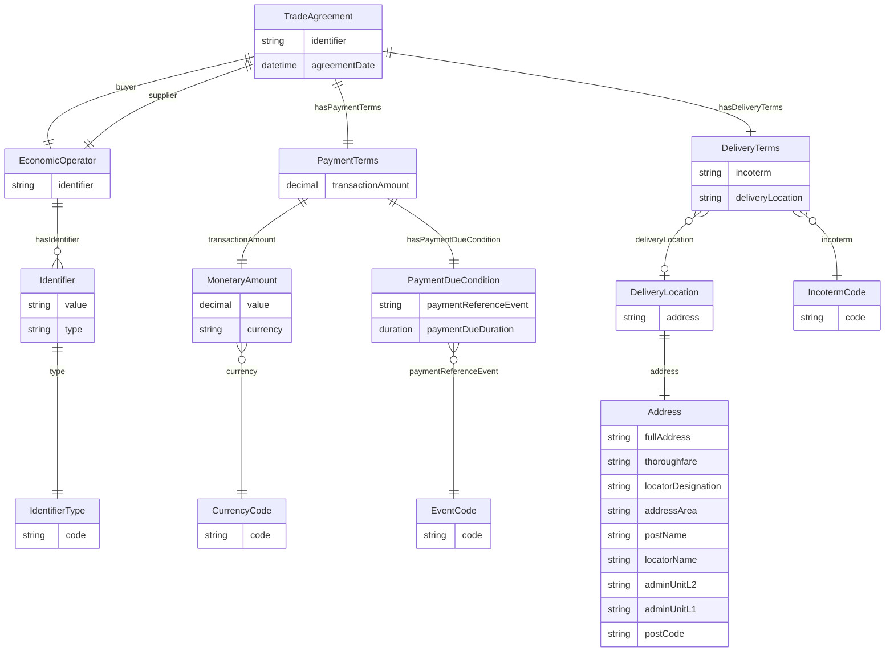

# Application Profile

## Innholdsfortegnelse
- [Application Profile](#application-profile)
  - [Namespaces](#namespaces)
  - [Conceptual Model (Tabular ER view)](#conceptual-model-tabular-er-view)
  - [Class TradeAgreement](#class-tradeagreement)
  - [Class EconomicOperator](#class-economicoperator)
  - [Class Identifier](#class-identifier)
  - [Class IdentifierType](#class-identifiertype)
  - [Class PaymentTerms](#class-paymentterms)
  - [Class MonetaryAmount](#class-monetaryamount)
  - [Class PaymentDueCondition](#class-paymentduecondition)
  - [Class DeliveryTerms](#class-deliveryterms)
  - [Class DeliveryLocation](#class-deliverylocation)
  - [Class Address](#class-address)
  - [Class CurrencyCode](#class-currencycode)
  - [Class IncotermCode](#class-incotermcode)
  - [Class EventCode](#class-eventcode)
  - [Controlled vocabularies](#controlled-vocabularies)

---

## Namespaces

```mdoc
| Prefix | Namespace |
|-------|----------|
| ebwv  | https://w3id.org/ebwv# |
| xsd   | http://www.w3.org/2001/XMLSchema# |
| skos  | http://www.w3.org/2004/02/skos/core# |
```

---

## Conceptual Model (Tabular ER view)



---

## Class TradeAgreement

```mdoc
URI: ebwv:TradeAgreement
Requirement Level: Mandatory

| Property         | URI                   | Range                 | Mult. | Req.      | Description                               | Note | Usage note |
|------------------|-----------------------|-----------------------|-------|-----------|-------------------------------------------|------|-----------|
| identifier       | ebwv:identifier       | xsd:string            | 0..1  | Optional  | Identifier of the agreement               |      | External identifier if available |
| agreementDate    | ebwv:agreementDate    | xsd:dateTime          | 1     | Mandatory | Date agreement becomes effective          |      | Legally binding date |
| buyer            | ebwv:buyer            | ebwv:EconomicOperator | 1     | Mandatory | Buyer party                               |      | |
| supplier         | ebwv:supplier         | ebwv:EconomicOperator | 1     | Mandatory | Supplier party                            |      | |
| hasPaymentTerms  | ebwv:hasPaymentTerms  | ebwv:PaymentTerms     | 1     | Mandatory | Payment terms                             |      | Exactly one per agreement |
| hasDeliveryTerms | ebwv:hasDeliveryTerms | ebwv:DeliveryTerms    | 1     | Mandatory | Delivery terms                            |      | Exactly one per agreement |
```

---

## Class EconomicOperator

```mdoc
URI: ebwv:EconomicOperator
Requirement Level: Mandatory

| Property    | URI             | Range          | Mult. | Req.      | Description                          | Note | Usage note |
|------------|------------------|----------------|-------|-----------|--------------------------------------|------|-----------|
| identifier | ebwv:identifier  | ebwv:Identifier| 1     | Mandatory | Identifier of the economic operator  |      | At least one identifier MUST be provided |
```

---

## Class Identifier

```mdoc
URI: ebwv:Identifier
Requirement Level: Mandatory

| Property | URI        | Range              | Mult. | Req.      | Description          | Note | Usage note |
|---------|------------|--------------------|-------|-----------|----------------------|------|-----------|
| value   | ebwv:value | xsd:string         | 1     | Mandatory | Identifier value     |      | |
| type    | ebwv:type  | ebwv:IdentifierType| 1..*  | Mandatory | Identifier type      | Value MUST be selected from a controlled vocabulary | See IdentifierType |
```

---

## Class IdentifierType

```mdoc
URI: ebwv:IdentifierType
Requirement Level: Mandatory

| Property | URI            | Range      | Mult. | Req.      | Description              | Note | Usage note |
|---------|-----------------|------------|-------|-----------|--------------------------|------|-----------|
| code    | skos:prefLabel  | xsd:string | 1     | Mandatory | Identifier type label    | Value MUST be selected from a controlled vocabulary (Vocabulary: Identifier Type Code List, URI: https://w3id.org/ebwv/codelist/identifier-type) | Application-specific scheme list |
```

---

## Class PaymentTerms

```mdoc
URI: ebwv:PaymentTerms
Requirement Level: Mandatory

| Property               | URI                     | Range                  | Mult. | Req.      | Description          | Note | Usage note |
|------------------------|--------------------------|------------------------|-------|-----------|----------------------|------|-----------|
| transactionAmount      | ebwv:transactionAmount   | ebwv:MonetaryAmount    | 1     | Mandatory | Amount to be paid    |      | |
| hasPaymentDueCondition | ebwv:hasPaymentDueCondition | ebwv:PaymentDueCondition | 1  | Mandatory | When payment is due  |      | |
```

---

## Class MonetaryAmount

```mdoc
URI: ebwv:MonetaryAmount
Requirement Level: Mandatory

| Property  | URI          | Range             | Mult. | Req.      | Description      | Note | Usage note |
|----------|--------------|-------------------|-------|-----------|------------------|------|-----------|
| value    | ebwv:value   | xsd:decimal       | 0..1  | Optional  | Numeric value    |      | |
| currency | ebwv:currency| ebwv:CurrencyCode | 1     | Mandatory | Currency         | Value MUST be selected from a controlled vocabulary: ISO 4217 Currency Codes (URI: http://publications.europa.eu/resource/authority/currency) | Use alphabetic codes |
```

---

## Class PaymentDueCondition

```mdoc
URI: ebwv:PaymentDueCondition
Requirement Level: Mandatory

| Property              | URI                     | Range          | Mult. | Req.      | Description                 | Note | Usage note |
|-----------------------|--------------------------|----------------|-------|-----------|-----------------------------|------|-----------|
| paymentReferenceEvent | ebwv:paymentReferenceEvent| ebwv:EventCode | 1     | Mandatory | Triggering reference event  | Value MUST be selected from a controlled vocabulary: Payment Reference Event Code List (URI: https://w3id.org/ebwv/codelist/payment-reference-event) | Domain-specific events |
| paymentDueDuration    | ebwv:paymentDueDuration  | xsd:duration   | 1     | Mandatory | Duration until due          |      | ISO 8601 duration |
```

---

