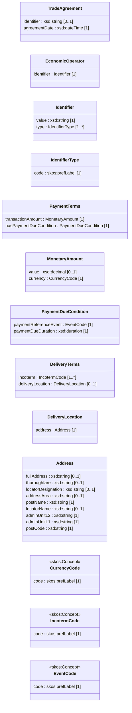

# Application Profile (Normative)

## Klasser
TradeAgreement, EconomicOperator, Identifier, IdentifierType, PaymentTerms, MonetaryAmount, PaymentDueCondition, DeliveryTerms, DeliveryLocation, Address, CurrencyCode, IncotermCode, EventCode

---

## Namespaces

| Prefix | Namespace |
|-------|----------|
| ebwv | https://w3id.org/ebwv# |
| xsd | http://www.w3.org/2001/XMLSchema# |
| skos | http://www.w3.org/2004/02/skos/core# |

---

## Conceptual Model (UML view)

---

## Class TradeAgreement

URI: ebwv:TradeAgreement
Requirement Level: Mandatory

| Property | URI | Range | Mult. | Req. | Description |
|---|---|---|---|---|---|
| identifier | ebwv:identifier | xsd:string | 0..1 | Optional | Identifier of the agreement |
| agreementDate | ebwv:agreementDate | xsd:dateTime | 1 | Mandatory | Date agreement becomes effective |
| buyer | ebwv:buyer | ebwv:EconomicOperator | 1 | Mandatory | Buyer party |
| supplier | ebwv:supplier | ebwv:EconomicOperator | 1 | Mandatory | Supplier party |
| hasPaymentTerms | ebwv:hasPaymentTerms | ebwv:PaymentTerms | 1 | Mandatory | Payment terms |
| hasDeliveryTerms | ebwv:hasDeliveryTerms | ebwv:DeliveryTerms | 1 | Mandatory | Delivery terms |

---

## Class EconomicOperator

URI: ebwv:EconomicOperator
Requirement Level: Mandatory

| Property | URI | Range | Mult. | Req. | Description |
|---|---|---|---|---|---|
| identifier | ebwv:identifier | ebwv:Identifier | 1 | Mandatory | Identifier of the economic operator |

---

## Class Identifier

URI: ebwv:Identifier
Requirement Level: Mandatory

| Property | URI | Range | Mult. | Req. | Description |
|---|---|---|---|---|---|
| value | ebwv:value | xsd:string | 1 | Mandatory | Identifier value |
| type | ebwv:type | ebwv:IdentifierType | 1..* | Mandatory | Identifier type |

---

## Class IdentifierType

URI: ebwv:IdentifierType
Requirement Level: Mandatory

| Property | URI | Range | Mult. | Req. | Description |
|---|---|---|---|---|---|
| code | skos:prefLabel | xsd:string | 1 | Mandatory | Identifier type label |

---

## Class PaymentTerms

URI: ebwv:PaymentTerms
Requirement Level: Mandatory

| Property | URI | Range | Mult. | Req. | Description |
|---|---|---|---|---|---|
| transactionAmount | ebwv:transactionAmount | ebwv:MonetaryAmount | 1 | Mandatory | Amount to be paid |
| hasPaymentDueCondition | ebwv:hasPaymentDueCondition | ebwv:PaymentDueCondition | 1 | Mandatory | When payment is due |

---

## Class MonetaryAmount

URI: ebwv:MonetaryAmount
Requirement Level: Mandatory

| Property | URI | Range | Mult. | Req. | Description |
|---|---|---|---|---|---|
| value | ebwv:value | xsd:decimal | 0..1 | Optional | Numeric value |
| currency | ebwv:currency | ebwv:CurrencyCode | 1 | Mandatory | Currency |

---

## Class PaymentDueCondition

URI: ebwv:PaymentDueCondition
Requirement Level: Mandatory

| Property | URI | Range | Mult. | Req. | Description |
|---|---|---|---|---|---|
| paymentReferenceEvent | ebwv:paymentReferenceEvent | ebwv:EventCode | 1 | Mandatory | Triggering reference event |
| paymentDueDuration | ebwv:paymentDueDuration | xsd:duration | 1 | Mandatory | Duration until due |

---

## Class DeliveryTerms

URI: ebwv:DeliveryTerms
Requirement Level: Mandatory

| Property | URI | Range | Mult. | Req. | Description |
|---|---|---|---|---|---|
| incoterm | ebwv:incoterm | ebwv:IncotermCode | 1..* | Mandatory | Applicable incoterms |
| deliveryLocation | ebwv:deliveryLocation | ebwv:DeliveryLocation | 0..1 | Optional | Delivery location |

---

## Class DeliveryLocation

URI: ebwv:DeliveryLocation
Requirement Level: Optional

| Property | URI | Range | Mult. | Req. | Description |
|---|---|---|---|---|---|
| address | ebwv:address | ebwv:Address | 1 | Mandatory | Delivery address |

---

## Class Address

URI: ebwv:Address
Requirement Level: Optional

| Property | URI | Range | Mult. | Req. | Description |
|---|---|---|---|---|---|
| fullAddress | ebwv:fullAddress | xsd:string | 0..1 | Optional | Full address |
| thoroughfare | ebwv:thoroughfare | xsd:string | 0..1 | Optional | Street name |
| locatorDesignation | ebwv:locatorDesignation | xsd:string | 0..1 | Optional | Street number |
| addressArea | ebwv:addressArea | xsd:string | 0..1 | Optional | Address area |
| postName | ebwv:postName | xsd:string | 1 | Mandatory | Post town |
| locatorName | ebwv:locatorName | xsd:string | 0..1 | Optional | Building name |
| adminUnitL2 | ebwv:adminUnitL2 | xsd:string | 1 | Mandatory | Municipality |
| adminUnitL1 | ebwv:adminUnitL1 | xsd:string | 1 | Mandatory | Region |
| postCode | ebwv:postCode | xsd:string | 1 | Mandatory | Postal code |

---

## Class CurrencyCode

URI: skos:Concept
Requirement Level: Mandatory

| Property | URI | Range | Mult. | Req. | Description |
|---|---|---|---|---|---|
| code | skos:prefLabel | xsd:string | 1 | Mandatory | Currency code |

---

## Class IncotermCode

URI: skos:Concept
Requirement Level: Mandatory

| Property | URI | Range | Mult. | Req. | Description |
|---|---|---|---|---|---|
| code | skos:prefLabel | xsd:string | 1 | Mandatory | Incoterm code |

---

## Class EventCode

URI: skos:Concept
Requirement Level: Mandatory

| Property | URI | Range | Mult. | Req. | Description |
|---|---|---|---|---|---|
| code | skos:prefLabel | xsd:string | 1 | Mandatory | Event code |
