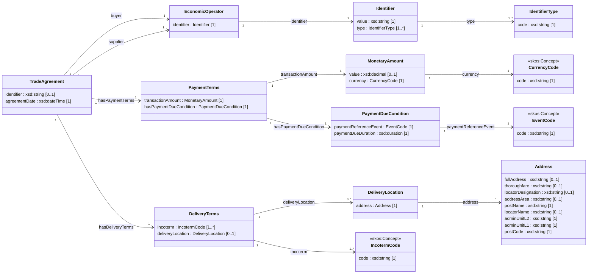

# Application Profile (Normative)

## Klasser
TradeAgreement, EconomicOperator, Identifier, IdentifierType, PaymentTerms, MonetaryAmount, PaymentDueCondition, DeliveryTerms, DeliveryLocation, Address, CurrencyCode, IncotermCode, EventCode

---

## Namespaces

| Prefix | Namespace |
|-------|----------|
| ebwv | https://w3id.org/ebwv# |
| xsd | http://www.w3.org/2001/XMLSchema# |
| skos | http://www.w3.org/2004/02/skos/core# |

---

## Conceptual Model (UML view)

---

## Class IdentifierType
URI: ebwv:IdentifierType
Requirement Level: Mandatory

| Property | URI | Range | Mult. | Req. |
|---|---|---|---|---|
| code | skos:prefLabel | xsd:string | 1 | Mandatory |

---

## Class CurrencyCode
URI: skos:Concept
Requirement Level: Mandatory

| Property | URI | Range | Mult. | Req. |
|---|---|---|---|---|
| code | skos:prefLabel | xsd:string | 1 | Mandatory |

---

## Class IncotermCode
URI: skos:Concept
Requirement Level: Mandatory

| Property | URI | Range | Mult. | Req. |
|---|---|---|---|---|
| code | skos:prefLabel | xsd:string | 1 | Mandatory |

---

## Class EventCode
URI: skos:Concept
Requirement Level: Mandatory

| Property | URI | Range | Mult. | Req. |
|---|---|---|---|---|
| code | skos:prefLabel | xsd:string | 1 | Mandatory |
